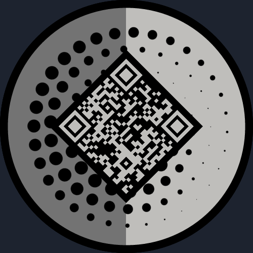

# AEGIS

Reclaiming Spaces, One SHIELD at a time 

AEGIS is an app made to reclaim and vet spaces because everyone deserves to feel safe. 

## Meet The Team
👤 **Aiden Balas**
- Github: [@luciolle24](https://github.com/luciolle24)

👤 **Léonard Verschuere**
- Github: [@verschhh](https://github.com/verschhh)
  
👤 **Maxime Lambert**
- Github: [@Dimerci](https://github.com/dimerci)

## Contributing

Contributions are always welcome!

See `contributing.md` for ways to get started.

Please adhere to this project's `code of conduct`.

## License

[TBD](https://choosealicense.com/licenses/mit/)

